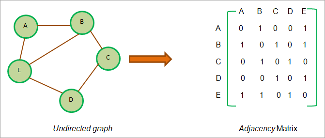

# graph

struktur grafik terutama mewakuli jaringan yang menghubungkna berbagai titik. titik-titik ini disebut sebgai simbul dn tautan yang menghubungkan simpul-simpul ini disebut '_tepian_'.jadi graf didefinisikan sebagai himpunan simpul V dan rusuk E yang menghubungkan simpul-simpul tersebut.

grafik sebagaina besar digunakan unutk mewakili berbagai jaringan seperti jaringan komputer, jaringan sosial, dll. grafik juga dapat digunakan untuk mewakili berbagai dependensi dalam perangkat lunak atau arsitektur. grafik ketergantungan ini sangat berguna dalam menganalisis perangkat lunak dan juga terkadang mendebugnya.

## berbagai varian graf

## 1 directed graf

graf berarah atau digraf adalah struktur data graf yang sisi-sisinya mempunya arah tertentu. mereka berasal dari satu simpul dan berujung ke simpul lain

```
a ->  b -> c
|          |
|          |
e <------- D
```

pada diagram diatas terdapat sisi dari titik A ke titik B. namun perlu diperhatikan bahwa a ke b tidak sama dengan b ke a seperti pada graf tak beraarah kecuali ada sisi yang ditentukan dari b ke a

graf beraarah jika terdapat paling sedikit satu lintasan yang simpul pertama dan terakhirnya sama. pada diagram diatas. jalur A -> b -> c -> D -> E -> A membentuk siklus berarah.

## weighted graf

dalam graf berbobot, bobot dikaitkan dengan setiap sisi graf. bobot biasanya menunjukkan jarak antara dua simpul.


## membuat graf

java tidak menyediakan implementasi penuh dari struktur data graf, namun kita dapat merepresentasikan graf secara terprogram menggunakan ``collections`` dalam java. kita juga dapat mengimplementasikan grafik menggunakan array dinamis seperti vektor.

cara paling umum untuk membuat grafik adalah dengan menggunakan salah satu representasi grafik seperti matriks ketetanggaan atau daftar ketetanggaan.

## matriks kedekatan

matriks kedekatan adalah representasi liniear dari grafik. matriks ini menyimpan pemetaan simpul dan tepi dari graf. dalam matriks ketetanggaan, simpul dari grafik mewwaikili baris dan kolom. Artinya jika graf memiliki ``N`` simpul, maka matriks ketetanggaan akan memiliki ukuran ``NxN``

jika ``V`` adalah himpunan simpul dari graf tersebut maka perpoitingan ``Mij`` pada list kedekatan = 1 berarti terdapat sisi antara sipul i dan j



seperti yang terlihat dari diagram diatas, kita melihat bahwa untuk titik ``A``, persimpangan ``AB`` dan ``AE`` diature ke ``1`` karena ada tepi dari ``A`` ke ``B`` dan ``A`` ke ``E``. demikian pula persimpangan ``BA`` diatur ke 1, karena ini adalah tidak berarah grafik ``AB = BA``. demikian pula, kita telah menetapkan semua persimpangan lain yang memiliki tepi ke ``1``.

contoh source dari implementasi graf pada java bisa dilihat [disini](ContohGraph.java)