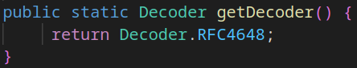

# Java Base64 Decoder

Didalam **JAVA** terdapat sebuah class yang bernama **Base64**. Class ini berisi method-method statis untuk melakukan encoding dan decoding dengan skema Base64.

Untuk menggunakannya, silahkan import package ```java.util.Base64``` terlebih dahulu.

 > **Dokumentasi ini hanya akan memberikan contoh basic penggunaan decoder untuk melakukan decoding dengan class Base64.Decoder**

Untuk penggunaan basic, kita cukup memanggil 2 method yaitu :

- ```getDecoder()```
    Method ini mengembalikan nilai berupa decoder Base64.
- ```decode(String str)```
    Method ini melakukan decoding terhadap String dengan skema decoding Base64.

### Contoh penggunaan
[](JavaBase64Decoder.java)

Dibawah ini akan didemonstrasikan cara melakukan decoding sebuah teks dengan format Base64.

```java
// String untuk didecode
String encodedText = "SGVsbG8sIEJlbGxzaGFkZSAh";

// Decoding
byte[] plainBytes = Base64.getDecoder().decode(encodedText);

// Deklarasi bytes hasil decode kedalam bentuk String
String plainString = new String(plainBytes);

// Tampilkan hasil decoding
System.out.println(plainString);
```

Alur kerja program diatas adalah :

1. Method ```getDecoder()``` mengembalikan nilai berupa decoder RFC4648.

    

    Method diatas dapat dilihat dalam class Base64 dengan menekan tombol ```CTRL + Left click``` pada nama method ```getDecoder()```.

2. Setelah mendapatkan decoder, method ```decode(encodedText)``` akan melakukan decoding terhadap kumpulan bytes dalam variabel ```plainBytes```.

3. Instansiasi class String dengan parameter nilai variabel ```plainBytes```.

Maka, outputnya adalah :

```
Hello, Bellshade !
```

[](../JavaBase64Encoder/README.md)