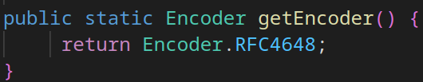

# Java Base64 Encoder

Didalam **JAVA** terdapat sebuah class yang bernama **Base64**. Class ini berisi method-method statis untuk melakukan encoding dan decoding dengan skema Base64.

Untuk menggunakannya, silahkan import package ```java.util.Base64``` terlebih dahulu.

 > **Dokumentasi ini hanya akan memberikan contoh basic penggunaan encoder untuk melakukan encoding dengan class Base64.Encoder**

Untuk penggunaan basic, kita cukup memanggil 2 method yaitu :

- ```getEncoder()```
    Method ini mengembalikan nilai berupa encoder Base64.
- ```encodeToString(byte[] src)```
    Method ini melakukan encoding terhadap kumpulan bytes kedalam String dengan skema encoding Base64.

### Contoh penggunaan
[](JavaBase64Encoder.java)

Dibawah ini akan didemonstrasikan cara melakukan encoding sebuah teks dengan format Base64.

```java
// Kalimat untuk diencode
String text = "Hello, Bellshade !";

// Encode format Base64
String Base64Text = Base64.getEncoder().encodeToString(text.getBytes());

// Tampilkan hasil encoding
System.out.println(Base64Text);
```

Alur kerja program diatas adalah :

1. Method ```getEncoder()``` mengembalikan nilai berupa encoder RFC4648.

    

    Method diatas dapat dilihat dalam class Base64 dengan menekan tombol ```CTRL + Left click``` pada nama method ```getEncoder()```.

2. Setelah mendapatkan encoder, method ```encodeToString(text.getBytes())``` akan melakukan encoding terhadap kumpulan bytes dalam variabel ```text```.

Maka, outputnya adalah :

```
SGVsbG8sIEJlbGxzaGFkZSAh
```

### Catatan :

> Perlu diketahui bahwa tujuan melakukan encoding bukan untuk menjaga kerahasiaan data, melainkan untuk memastikan bahwa data dapat dikonsumsi atau digunakan oleh sistem dengan tipe yang berbeda-beda.