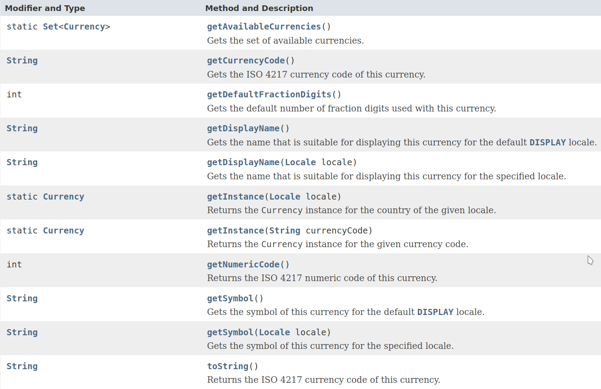

# Java Currency

Didalam **JAVA** terdapat sebuah class yang bernama **_Currency_**. Class ini berguna untuk merepresentasikan informasi tentang mata uang yang diidentifikasi __ISO 4217__. Tujuan ISO 4217 adalah menetapkan kode yang diakui secara internasional untuk representasi mata uang. Mata uang dapat direpresentasikan dalam dua cara, yakni dengan tiga huruf kode alfabet dan tiga digit kode numerik.

Method-method yang bisa dipakai dalam class ini antara lain :

- ```getCurrencyCode()```
    mengembalikan nilai kode mata uang ISO 4217 berdasarkan argumen mata uang yang diinput.

- ```getInstance()```
    mengembalikan instance mata uang berdasarkan argumen kode mata uang yang diinput.

- ```getDefaultFractionDigits()```
    mengembalikan jumlah default digit pecahan mata uang berdasarkan argumen kode negara yang diinput.

- ```getDisplayName()```
    mengembalikan nilai berupa nama mata uang berdasarkan argumen kode mata uang yang diinput.

- ```getSymbol()```
    mengembalikan nilai berupa simbol mata uang berdasarkan argumen kode mata uang yang diinput.

### Contoh penggunaan
[](JavaCurrency.java)

Kita akan mengambil instance dari mata uang negara Australia dan Jepang dengan memanggil method ```getInstance()``` disertai kode alfabet mata uangnya sebagai argumen.

```Java
Currency mataUang1 = Currency.getInstance("AUD"); // AUD
Currency mataUang2 = Currency.getInstance("JPY"); // JPY

System.out.println(mataUang1.getCurrencyCode());
System.out.println(mataUang2.getCurrencyCode());
```

Maka outputnya adalah

```
AUD
JPY
```

Namun, jika argumen yang dikirim berupa kode alfabet mata uang yang tidak valid maka akan terjadi error. Misal :

```Java
Currency mataUang3 = Currency.getInstance("USDA"); // Tidak valid

System.out.println(mataUang3.getCurrencyCode());
```

Maka outputnya adalah

```
Exception in thread "main" java.lang.IllegalArgumentException
        at java.base/java.util.Currency.getInstance(Currency.java:321)
        at java.base/java.util.Currency.getInstance(Currency.java:302)
        at JavaCurrency.main(JavaCurrency.java:5)
```

Selanjutnya, kita akan coba mengambil data jumlah digit default dari kedua mata uang tersebut dengan menjalankan method ```getDefaultFractionDigits()```.

```java
System.out.println("Digit AUD : " + mataUang1.getDefaultFractionDigits());
System.out.println("Digit JPY : " + mataUang2.getDefaultFractionDigits());
```

Maka outputnya adalah

```
Digit AUD : 2
Digit JPY : 0
```

Lalu, bagaimana cara mengambil data nama mata uang beserta simbolnya ?

Untuk mengambil data nama mata uang, jalankan method ```getDisplayName()```.

```java
System.out.println(mataUang1.getDisplayName());
System.out.println(mataUang2.getDisplayName());
```

Maka, outputnya adalah

```
Australian Dollar
Japanese Yen
```

Sedangkan untuk data simbol mata uang, bisa diambil dengan menjalankan method ```getSymbol()```.

```java
System.out.println(mataUang1.getSymbol());
System.out.println(mataUang2.getSymbol());
```

Maka, outputnya adalah

```
A$
?
```

### Apakah ada method lain yang bisa digunakan ?

Ya, ada method-method lain yang bisa digunakan.

