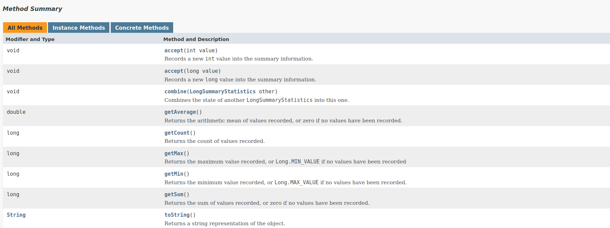

# Java Long Summary Statistics

Didalam **JAVA** terdapat sebuah class yang bernama **LongSummaryStatistics**. Class ini berguna untuk menerima sekumpulan data angka untuk dilakukan pengoperasian seperti *sum*, *min*, *max*, *average*, dan lain-lain.

Untuk menggunakannya, silahkan import package ```java.util.LongSummaryStatistics``` terlebih dahulu.

Terdapat 6 method yang akan didemonstrasikan penggunaannya dalam dokumentasi ini, yaitu :

- ```accept(long value)```
    Memasukkan nilai bertipe Integer atau Long kedalam object class **LongSummaryStatistics**.
- ```getSum()```.
    Mengembalikan nilai hasil penjumlahan dari seluruh data yang ada.
- ```getMin()```
    Mengembalikan nilai berupa angka terkecil dari seluruh data yang ada.
- ```getMax()```
    Mengembalikan nilai berupa angka terbesar dari seluruh data yang ada.
- ```getAverage()```
    Mengembalikan nilai berupa hasil rata-rata dari seluruh data yang ada.
- ```getCount()```
    Mengembalikan nilai berupa berapa banyak nilai data yang ada.

### Contoh penggunaan
[](JavaLongSummaryStatistics.java)

Dibawah ini akan didemonstrasikan cara penggunaan dari kelima method yang disebutkan diatas.

```java
// Membuat objek dari class LongSummaryStatistics
LongSummaryStatistics data = new LongSummaryStatistics();

// Memasukkan nilai-nilai kedalam object class
data.accept(1000);
data.accept(2000);
data.accept(3000);
data.accept(4000);
data.accept(5000);

// Menampilkan hasil rata-rata
System.out.println("Rata-rata : " + data.getAverage());

// Menampilkan hasil penjumlahan dari seluruh data nilai
System.out.println("Hasil penjumlahan seluruh data : " + data.getSum());

// Menampilkan nilai terbesar
System.out.println("Nilai terbesar : " + data.getMax());

// Menampilkan nilai terkecil
System.out.println("Nilai terkecil : " + data.getMin());

// Menampilkan jumlah data yang tersedia
System.out.println("Jumlah data yang tersedia : " + data.getCount());
```

Maka, outputnya adalah

```
Rata-rata : 3000.0
Hasil penjumlahan seluruh data : 15000
Nilai terbesar : 5000
Nilai terkecil : 1000
Jumlah data yang tersedia : 5
```

### Apakah ada method lain yang bisa digunakan ?

Ya, ada method-method lain yang bisa digunakan.



[](https://docs.oracle.com/javase/8/docs/api/java/util/LongSummaryStatistics.html#method.summary)