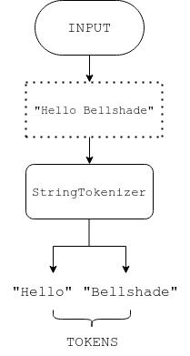
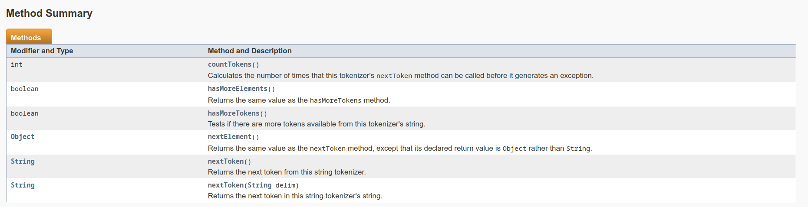

# Java StringTokenizer

Didalam **JAVA** terdapat sebuah class yang bernama **_StringTokenizer_**. Class ini berguna untuk memecah string kedalam bentuk _tokens_. Tidak seperti class **_StreamTokenizer_**, class ini tidak memiliki fitur untuk membedakan antara data angka, string, maupun _identifiers_.

Untuk menggunakannya, silahkan import package ```java.util.StringTokenizer``` terlebih dahulu.




Terdapat 3 constuctor dalam class **_StringTokenizer_**, yaitu :

- ```StringTokenizer(String str)```
    Membuat token berdasarkan argumen string yang diinput
- ```StringTokenizer(String str, String delim)```.
    Membuat token berdasarkan argumen string dan _delimiter_ (pemisah) yang diinput.
- ```StringTokenizer(String str, String delim, boolean returnValue)```
    Membuat token berdasarkan argumen string, _delimiter_, dan boolean returnValue yang diinput. Jika boolean returnValue bernilai **true** maka _delimiter_ dibaca sebagai token, sedangkan jika returnValue bernilai **false** maka _delimiter_ berfungsi untuk memisah-misahkan token.

Method-method yang terdapat dalam class **_StringTokenizer_** :

- ```boolean hasMoreTokens()```, untuk melakukan pengecekan apakah masih ada token yang tersedia.
- ```int countTokens()```, untuk menghitung jumlah keseluruhan token yang tersedia.
- ```Object nextElement()```, untuk mengambil data token selanjutnya dan mengembalikannya dalam bentuk Object.
- ```String nextToken()```, untuk mengambil data token selanjutnya dan mengembalikannya dalam bentuk String.
- ```boolean hasMoreElements()```, untuk melakukan hal yang sama seperti method ```boolean hasMoreTokens()```.

### Contoh penggunaan
[](JavaStringTokenizer.java)

Dibawah ini akan didemonstrasikan cara melakukan tokenisasi string dan memisah-misahkannya dengan karakter whitespace (spasi).

```java
StringTokenizer strings = new StringTokenizer("My name is Caroline."," ");

while (strings.hasMoreTokens()) {  
    System.out.println(strings.nextToken());  
}
```

Dengan method ```hasMoreTokens()``` diatas, akan dicek apakah masih ada token yang tersedia. Selama masih ada, maka token tersebut dicetak. Begitu juga dengan token selanjutnya ( ```nextToken()``` ).

Maka, outputnya adalah

```
My
name
is
Caroline.
```

Selanjutnya, kita akan coba menggunakan method ```nextToken()``` dengan _delimiter_ berupa tanda koma, namun tidak dimasukkan kedalam blok perulangan.

```java
StringTokenizer strings = new StringTokenizer("Hello, nice to meet you.");
System.out.println(strings.nextToken(","));  
```

Karena tidak dilakukan perulangan dalam membaca token, maka hanya diambil 1 token, yaitu token yang berada sebelum _delimiter_ (,).

Maka, outputnya adalah

```
Hello
```

Selanjutnya, kita akan coba menggunakan method ```countTokens()``` untuk menghitung jumlah keseluruhan token yang ada.

```java
StringTokenizer strings = new StringTokenizer("Hello, nice to meet you.");
System.out.println(strings.countTokens());
```

Maka, outputnya adalah

```
5
```

Selanjutnya, kita akan coba menggunakan method ```hasMoreElements()``` untuk menghitung jumlah keseluruhan token yang ada.

```java
StringTokenizer strings = new StringTokenizer("Hello, world !"," ");

while (strings.hasMoreElements()) {    
    System.out.println(strings.nextToken());
}
```

Maka, outputnya adalah

```
Hello,
world
!
```

Dapat dilihat bahwa method ```hasMoreElements()``` memiliki cara kerja yang sama dengan method ```hasMoreTokens()```.

### Daftar lengkap method Class StringTokenizer



[](https://docs.oracle.com/javase/7/docs/api/java/util/StringTokenizer.html#method_detail)